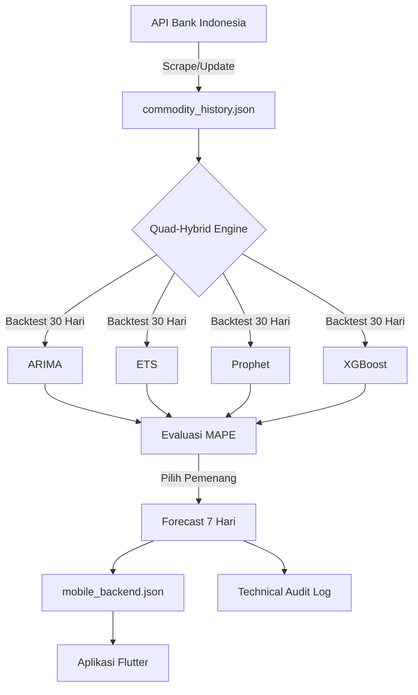

<p align="center">
  
</p>

<h1 align="center">🚀 Quad-Hybrid Commodity Forecasting Engine (v1.0.0)</h1>


Sistem Backend cerdas berbasis Python yang dirancang untuk memprediksi harga komoditas pangan di Indonesia. Sistem ini menggunakan pendekatan **Quad-Hybrid Competition** untuk memastikan akurasi tertinggi setiap harinya.

## 📌 Context & Purpose
Pasar komoditas pangan di Indonesia sangat fluktuatif, terutama menjelang hari raya besar. Proyek ini dibangun untuk:
*   **Mengurangi Ketidakpastian:** Memberikan gambaran tren harga 7 hari ke depan bagi pelaku UMKM dan konsumen.
*   **Akurasi Berbasis Data:** Mengeliminasi spekulasi dengan menggunakan kompetisi algoritma AI yang terus diperbarui.
*   **Integrasi Mobile:** Menyediakan data siap saji untuk aplikasi mobile guna memantau harga secara *real-time*.

## 📊 Arsitektur Sistem



## 🌟 Fitur Utama

### 1. Mesin Prediksi Quad-Hybrid
Tidak seperti sistem standar yang hanya menggunakan satu model, sistem ini mengadu 4 algoritma berbeda setiap kali dijalankan:
*   **ARIMA (AutoRegressive Integrated Moving Average):** Handal untuk tren linear dan data stasioner.
*   **ETS (Exponential Smoothing):** Sangat baik dalam menangkap tren dan error secara halus.
*   **Prophet (by Meta):** Spesialis dalam menangani pola musiman (seasonality) dan hari libur.
*   **XGBoost (Extreme Gradient Boosting):** Model Machine Learning yang mampu menangkap pola non-linear yang kompleks dan fitur teknis.

### 2. Indonesian Market Intelligence (Holiday Aware)
Sistem ini dirancang khusus untuk pasar Indonesia:
*   **Kalender Libur Nasional:** Menggunakan library `holidays` Indonesia untuk memberitahu Prophet kapan harga mungkin bergejolak.
*   **Antisipasi Lonjakan (H-7):** Fitur khusus pada XGBoost yang memberikan sinyal 7 hari sebelum hari raya, karena secara historis harga pangan di Indonesia melonjak *sebelum* hari H.

### 3. Sistem Audit & Transparansi (Audit-Ready)
Sistem menghasilkan file audit di folder `archive/` setiap hari. File ini menyimpan ramalan dari **semua model** (bukan cuma pemenang) sehingga Anda bisa melakukan evaluasi "Head-to-Head" di dunia nyata.

### 4. Output Teroptimasi untuk Mobile
File `mobile_backend.json` menyediakan data yang siap pakai tanpa perlu pemrosesan berat di sisi Flutter:
*   **Analisis Narasi Dinamis (Generative AI):** Menggunakan integrasi OpenAI/Gemini untuk merangkum pergerakan harga komoditas menjadi insight yang unik, enak dibaca (human-like), dan bervariasi setiap harinya.
*   Data grafik yang sudah di-sampling (History 30 hari + Forecast 7 hari).
*   Indikator keandalan (Reliability) berdasarkan skor MAPE.

## 📂 Struktur Proyek

*   `run_all.py`: Entry point tipis untuk menjalankan seluruh generator backend mobile.
*   `update_data.py`: Entry point untuk sinkronisasi data harga dari API BI/PIHPS.
*   `api_server.py`: Entry point tipis untuk menjalankan API server.
*   `commodity_forecaster.py`: Compatibility layer agar import lama tetap berjalan.
*   `commodity_prediction/domain/`: Entity dan port/kontrak inti yang tidak bergantung pada framework, API eksternal, atau storage.
*   `commodity_prediction/application/`: Use case dan service aplikasi seperti forecast komoditas, backtesting, dan generator backend mobile.
*   `commodity_prediction/infrastructure/`: Adapter konkret untuk JSON/PIHPS, model ML, chart output, dan LLM insight.
*   `commodity_prediction/interfaces/`: Interface adapter seperti FastAPI server dan CLI-facing entrypoint.
*   `commodity_prediction/config.py`: Konfigurasi komoditas, path output, horizon prediksi, dan daftar model.
*   `commodity_prediction/data.py`, `pipeline.py`, `features.py`, `mobile_backend.py`, `insights.py`, `plotting.py`: Facade kompatibilitas untuk import lama; implementasi utama berada di layer clean architecture.
*   `output/`: Folder output untuk Mobile & Grafik.
*   `archive/`: Folder arsip harian untuk keperluan audit manual.

## 🛠️ Instalasi & Persiapan

1.  **Clone & Install Dependensi:**
    ```bash
    pip install -r requirements.txt
    ```
2.  **Konfigurasi Environment (Opsional untuk Insight AI):**
    Buat file `.env` di direktori proyek dan masukkan kredensial API Anda (Sistem otomatis membaca file ini menggunakan `python-dotenv`):
    ```env
    OPENAI_API_KEY=sk-proj-YOUR_API_KEY
    ```
3.  **Menjalankan Pipeline:**
    ```bash
    python3 run_all.py
    ```

## 📅 Otomatisasi (Deployment)

Untuk penggunaan produksi, disarankan memasang **Cron Job** pada server (VPS):
```bash
# Menjalankan update & prediksi setiap jam 10 pagi WIB
0 10 * * * cd /path/to/project && /usr/bin/python3 run_all.py >> cron.log 2>&1
```

## 📱 Panduan Integrasi Flutter

Data di `mobile_backend.json` memiliki struktur:
*   `metadata`: Berisi ringkasan pasar global (`global_analysis`).
*   `commodities`: Array berisi objek komoditas.
    *   `current_price`: Harga titik awal untuk grafik.
    *   `forecast`: Array 7 titik ramalan.
    *   `reliability`: Status "SANGAT TINGGI", "TINGGI", atau "CUKUP".

---
**Developer:** Rizky Hamdana  
**Engine Version:** 1.0.0 (Production Stable)
